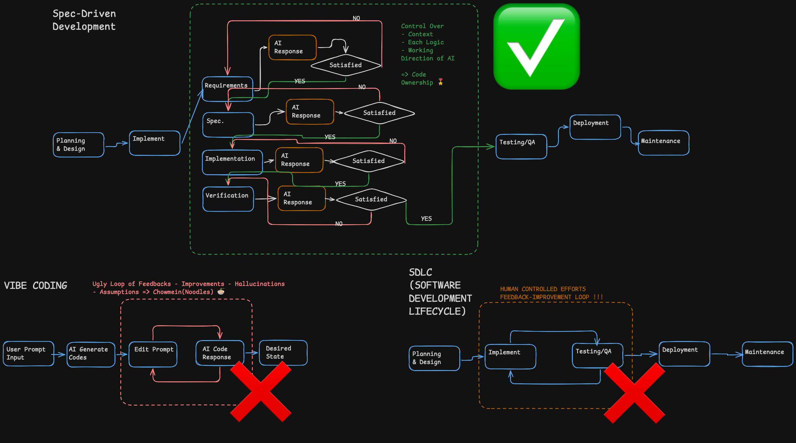
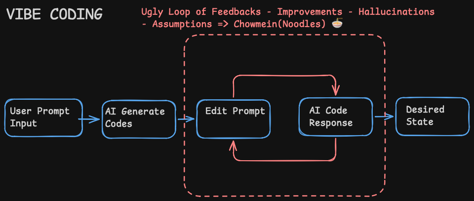
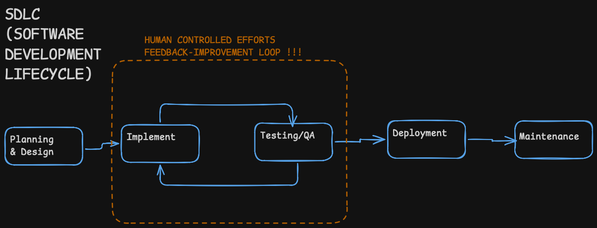
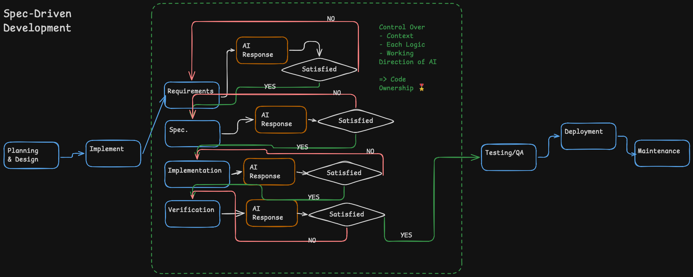

# Spec-Driven Development: AI Assisted Coding with Clarity

Building apps today is changing. Writing and reviewing code used to be the hardest part. Now it's knowing how to tell an LLM what you want. That skill is **spec-driven development**.

## Vibe Coding vs Traditional SDLC

**Vibe coding** is what most people think of with AI coding agents:

- Start with a prompt (e.g., "build a login page in Python")
- AI generates boilerplate
- Edit prompt, regenerate, repeat until it works
- No planning phase — the LLM guesses the implementation each time
- Inconsistent results — a hundred tries can give a hundred different outcomes
- Can take longer than writing the code yourself

This skips the **Software Development Lifecycle (SDLC)**. Traditional SDLC goes: Plan → Design → Implement → Test → Deploy → Maintain. Vibe coding jumps straight to implementation, which means every run can produce different results.

## What is Spec-Driven Development?

Spec-driven development (spec coding) adds SDLC structure to AI-generated software. 

Instead of prompting an implementation, you prompt:

- **Behavior** — what the system should do
- **Constraints** — rules and boundaries

AI models are all about proper instructions. Giving the LLM a clear spec upfront is much better than making it guess what solution fits your request. These become a **requirements specification** — a contract that guides all downstream work: code, tests, docs, verification. Nothing is implemented until the spec is approved.

### The Flow

1. **Prompt** → requirements spec (behavior + constraints)
2. **Approve/Edit** spec — nothing is built yet
3. **Design doc** with implementation to-dos
4. **AI agent implements** code from the design
5. **Generate tests** from the same spec

The spec becomes the **primary artifact** — it drives everything downstream.

## How It Differs

| Approach | Start with | Strength |
|---|---|---|
| Vibe coding | Prompt | Quick prototyping |
| Traditional dev | Code | Intuition-driven |
| Test-driven dev (TDD) | Tests | Behavior-first |
| Behavior-driven dev (BDD) | Scenarios | Communication-first |
| Spec-driven dev (SDD) | Specification | Contract-first |

SDD is like TDD and BDD on steroids — the spec becomes the primary artifact driving implementation, tests, and verification.

## Example: User Authentication

### Vibe Coding

- Prompt: "build a /login endpoint"
- AI guesses the structure — libraries, error handling, validation
- 30 different ways to implement it — back-and-forth edits until it works

### Spec-Driven

Define the feature and build it out in spec first:

1. **Behavior**: "POST /login endpoint accepting `user` and `pass` variables"
2. **Failure conditions**: "return error if username is missing"
3. **Test cases**: "valid credentials → 200 response"
4. AI implements from the spec — no guessing needed

The key difference: less ambiguity. The LLM knows *why* it's making decisions, and every implementation matches a shared contract.

## Why It Matters

- Removes ambiguity from AI coding — the LLM doesn't have to guess
- Produces consistent, repeatable results
- Documents intent (not just code) — you capture *why* things are built
- Works across implementation, testing, and verification from a single source of truth
- Fits naturally into the SDLC instead of skipping it
